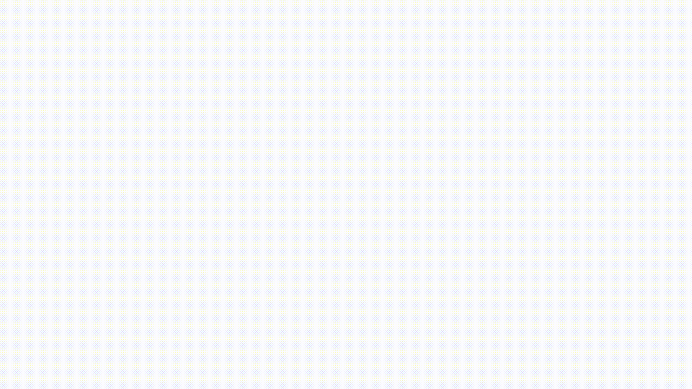

<p align="center">
  
</p>
<h3 align="center">Thermostat app</h3>

---

## 📝 Table of Contents

- [About](#about)
- [Getting Started](#getting_started)
- [Tests](#tests)
- [Tools](#tools)

## 🧐 About <a name = "about"></a>

This repo is made to showcase one of the test assignments that I have done. The task is to build a component which is a light implementation of a thermostat.

### Requirements:

> We want you to create a small thermostat dashboard.
> It needs the following:
>
> - Current temperature in the room.
> - Current set temperature.
> - Time of latest update.
> - Button to increment the temperature by half a degree at the time.
> - Button to decrement the temperatture by half a degree at the time.
> - The increment / decrement buttons should not disable when they are clicked. Your user should be able to press the button multiple times to increate / decrease the the temp a couple of degrees. Be aware here about updating the data too many times.
>
> We want you to fetch the data at least every 2 seconds to update the current temperature and the time of last update.
> Be aware of race conditions. The patch api call takes about 1 second to update the data.
> It also is possible that when you get the data, you will receive a `202` HTTP-code instead of the data.
> This means that the backend has received your request ,but it can not send you the latest data. When this happens, you >need to retry the API call. (The backend is set to have a 50-50 chance to send the data or return a `202`).
>
> ### API
>
> This starterpack gives you the working API that you need and the basics to start the client project.
> the API will start at http://localhost:9090
>
> This will spin up a node express server for the API.
> There are 2 endpoints for this api.
>
> | url                    | method |
> | ---------------------- | ------ |
> | http://localhost:9090/ | GET    |
> | http://localhost:9090/ | PATCH  |
> |                        |        |
>
> ### Client
>
> Please put all your custom code in the `./client` directory.
> The only requirement we have is that you use React, other than that you can do what ever libraries you want.

## 🏁 Getting Started <a name = "getting_started"></a>

These instructions will get you a copy of the project up and running on your local machine for
development and testing purposes.

### Install server dependencies

```sh
# yarn
yarn

# npm
npm install
```

### Install client dependencies

```sh
# yarn
yarn install:client

# npm
npm run install:client
```

### Start client and server

```sh
# yarn
yarn start

# npm
npm run start
```

Now you can open the app at `http://localhost:3000/`.

## 🔧 Running tests <a name = "tests"></a>

There are both unit and e2e tests implemented.

### Unit tests

In order to check unit tests coverage rates run from the `root` folder:

```sh
# yarn
yarn test:client

# npm
npm run test:client
```

Or from the `client` folder:

```sh
# yarn
yarn test:coverage

# npm
npm run test:coverage
```

You may also open the coverage report locally from here:
`client/coverage/lcov-report/index.html`


### e2e tests

> ⚠️ Keep in mind you should restart server before running e2e tests.
> Use `yarn start` from the `root` folder to do this.

In order to check e2e tests coverage headlessly(without displaying the browser) run from the `client` folder:

```sh
# yarn
yarn e2e

# npm
npm run e2e
```

In order to check e2e tests coverage headed(with displaying the browser) run from the `client` folder:

```sh
# yarn
yarn e2e:headed

# npm
npm run e2e:headed
```

You may find the e2e tests captured video here: `client/cypress/videos/`



## ⛏️ Tools <a name = "tools"></a>

- [React](https://reactjs.org/)
- [Create React App](https://create-react-app.dev/)
- [RxJS](https://rxjs-dev.firebaseapp.com/)
- [TypeScript](https://www.typescriptlang.org/)
- [Jest](https://jestjs.io/)
- [React Testing Library](https://testing-library.com/docs/react-testing-library/intro)
- [Cypress](https://www.cypress.io/)
# Micky
